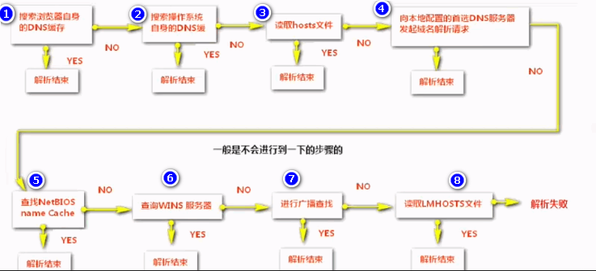
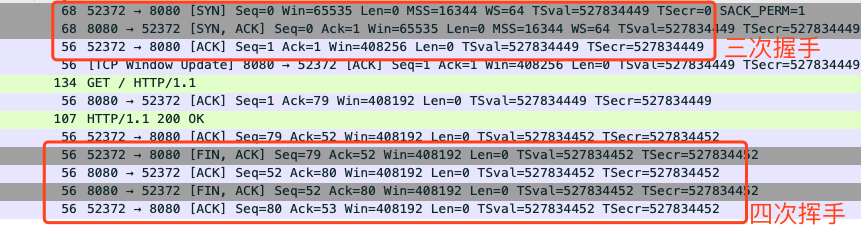
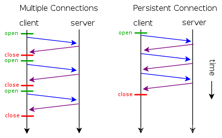
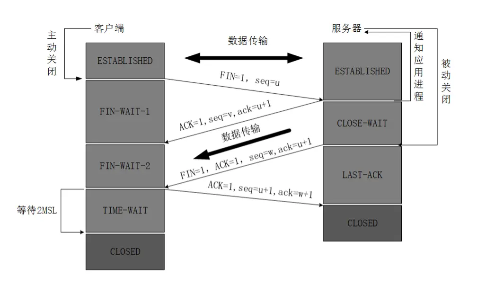
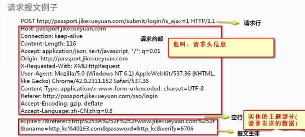
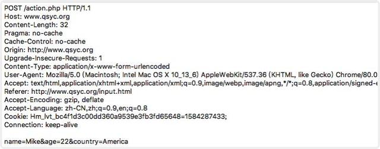
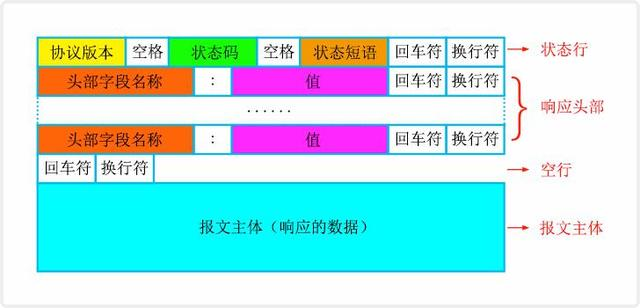

## https

 1.HTTP协议，浏览器和服务器之间互相通信的规则.

### HTTP工作流程
什么是HTTP事务? HTTP事务 = 请求命令 + 响应结果

1.域名解析  ->  2.client建立连接 ->3.server返回received  ->  4.c发起HTTP请求  ->  5.s响应

#### 1.域名解析

### http请求
#### 三次握手
1.client建立连接 ->  2.server返回received  ->  3.c发起HTTP请求  ->  4.s响应

第一次握手：Client将标志位SYN置为1，随机产生一个值seq=J，并将该数据包发送给Server，Client进入SYN_SENT状态，等待Server确认。

第二次握手：Server收到数据包后由标志位SYN=1知道Client请求建立连接，Server将标志位SYN和ACK都置为1，ack=J+1，随机产生一个值seq=K，并将该数据包发送给Client以确认连接请求，Server进入SYN_RCVD状态。

第三次握手：Client收到确认后，检查ack是否为J+1，ACK是否为1，如果正确则将标志位ACK置为1，ack=K+1，并将该数据包发送给Server，Server检查ack是否为K+1，ACK是否为1，如果正确则连接建立成功，Client和Server进入ESTABLISHED状态，完成三次握手，随后Client与Server之间可以开始传输数据了。

SYN(synchronous建立联机) ACK(acknowledgement 确认) PSH(push传送) FIN(finish结束) RST(reset重置) URG(urgent紧急)Sequence number(顺序号码) Acknowledge number(确认号码)

HTTP协议采用“请求-应答”模式，当使用普通模式，即非KeepAlive模式时，每个请求/应答客户和服务器都要新建一个连接，完成之后立即断开连接（HTTP协议为无连接的协议）；当使用Keep-Alive模式（又称持久连接、连接重用）时，Keep-Alive功能使客户端到服务器端的连接持续有效，当出现对服务器的后继请求时，Keep-Alive功能避免了建立或者重新建立连接。

短连接
所谓短连接，就是每次请求一个资源就建立连接，请求完成后连接立马关闭。每次请求都经过“创建tcp连接->请求资源->响应资源->释放连接”这样的过程

长连接
所谓长连接(persistent connection)，就是只建立一次连接，多次资源请求都复用该连接，完成后关闭。要请求一个页面上的十张图，只需要建立一次tcp连接，然后依次请求十张图，等待资源响应，释放连接。

并行连接
所谓并行连接(multiple connections)，其实就是并发的短连接。
————————————————

#### 四次挥手：

第一次挥手：TCP发送一个FIN(结束)，用来关闭客户到服务端的连接。

第二次挥手：服务端收到这个FIN，他发回一个ACK(确认)，确认收到序号为收到序号+1，和SYN一样，一个FIN将占用一个序号。TCP服务器通知高层的应用进程，客户端向服务器的方向就释放了，这时候处于半关闭状态，即客户端已经没有数据要发送了，但是服务器若发送数据，客户端依然要接受。（服务器端继续发送未发送完的数据）

第三次挥手：服务端发送一个FIN(结束)到客户端，服务端关闭客户端的连接。

第四次挥手：客户端发送ACK(确认)报文确认，并将确认的序号+1，这样关闭完成。

注：1、那么为什么是4次挥手呢？tcp握手的时候为何ACK(确认)和SYN(建立连接)是一起发送。挥手的时候为什么是分开的时候发送呢？

因为当Server端收到Client端的SYN连接请求报文后，可以直接发送SYN+ACK报文。其中ACK报文是用来应答的，SYN报文是用来同步的。但是关闭连接时，当Server端收到FIN报文时，很可能并不会立即关闭 SOCKET，所以只能先回复一个ACK报文，告诉Client端，"你发的FIN报文我收到了"。只有等到我Server端所有的报文都发送完了，我才能发送FIN报文，因此不能一起发送。故需要四步握手。

#### 3.请求报文

浏览器自动加上请求报文。

#### 5.响应报文

